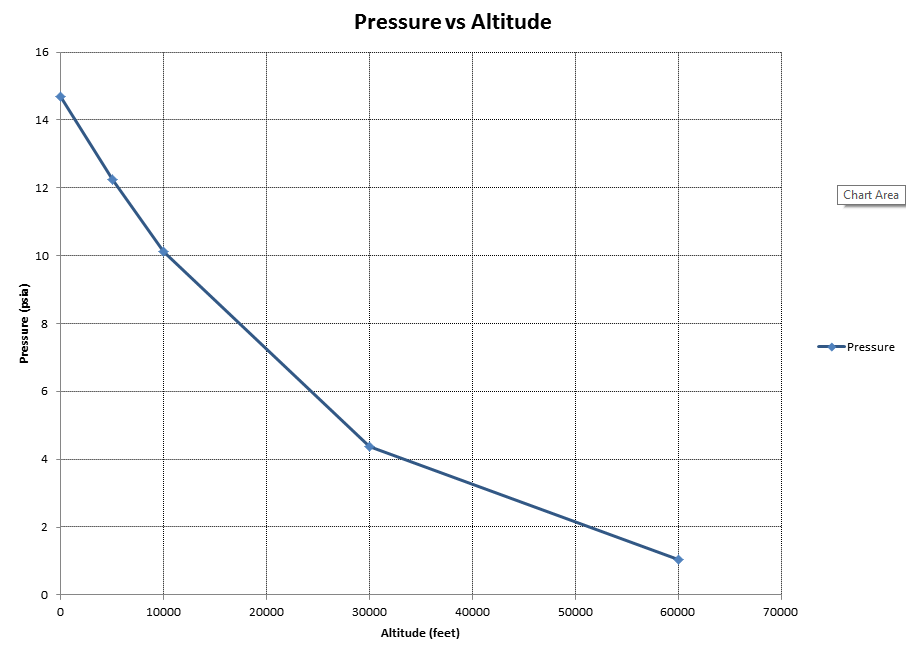

.. examples

Examples
========

Altitude vs Pressure
--------------------

This is a simple scatter plot of a standard atmospheric pressure vs altitude.

`Click images to see full size`

:download:`download alt_vs_press.ods <./_static/alt_vs_press.ods>`

:download:`download alt_vs_press.py <./_static/alt_vs_press.py>`

The python code below generates the plot shown above. The basic approach is to create 
a ``list_of_rows`` containing the data labels, units and values. Make a data sheet with 
the ``add_sheet`` command. Create a scatter plot with the ``add_scatter`` command. And finally,
save as an ``ods`` file with the ``save`` command.

The ``list_of_rows`` input variable has the following format.

    * Row 1 holds all of the labels of each column
    * Row 2 holds the units for each column (use '' for no units)
    * Rows 3 through N hold data values.

After saving, the spreadsheet can be launched with the ``launch_application`` command and either
Excel or OpenOffice will open depending on which is linked to ods files on your system. (Note that the 
``save`` command also has a ``launch=True`` option, shown in the next example.)

.. code:: python

    from odscharts.spreadsheet import SpreadSheet

    mySprSht = SpreadSheet()

    list_of_rows = [['Altitude','Pressure'], ['feet','psia'], 
                    [0, 14.7],    [5000, 12.23], [10000, 10.11],   
                    [30000, 4.36],[60000, 1.04]]

    mySprSht.add_sheet('Alt_Data', list_of_rows)

    mySprSht.add_scatter( 'Alt_P_Plot', 'Alt_Data',
                              title='Pressure vs Altitude', 
                              xlabel='Altitude', 
                              ylabel='Pressure', 
                              xcol=1,
                              ycolL=[2])
    mySprSht.save( filename='alt_vs_press' )

    mySprSht.launch_application()

Trig Functions
--------------

The trig function example builds a large ``list_of_rows`` variable to display sine and cosine functions.

See :ref:`internal_trig_example` on the QuickStart page for further details of the Trig Function example.

:download:`download trig_plot.ods <./_static/trig_plot.ods>`

:download:`download trig_funcs.py <./_static/trig_funcs.py>`

Line Styles
-----------

There are 10 dashed line styles in ``ODSCharts``. This example shows them all.

Notice that OpenOffice renders the various line styles more distinctly than Excel.  
(i.e. A number of the styles are hard to distinguish from one another in Excel.)

.. raw:: html

    <table border="1">
    <tr>
    <th>Excel Output</th>  <th>OpenOffice Output</th></tr>
    <tr>
        <td> 
            
        </td>
        <td> 
            
        </td>
    </tr>
    </table>

`Click images to see full size`

:download:`download line_style_plot.ods <./_static/line_style_plot.ods>`

:download:`download line_styles.py <./_static/line_styles.py>`

The python code below generates the plots shown above.

.. code:: python

    """
    This example demonstrates the use of line styles
    """
    from math import *
    from odscharts.spreadsheet import SpreadSheet
    from odscharts.line_styles import LINE_STYLE_LIST as sL

    mySprSht = SpreadSheet()
    rev_orderL = list( range(10,-1,-1) )

    toprow = ['Line Style Index']
    unitsrow = ['']
    toprow.extend( ['%i) %s'%(i,sL[i]) for i in rev_orderL] )
    unitsrow.extend( ['' for i in rev_orderL] )

    xbegrow = [0]
    xbegrow.extend( [i for i in rev_orderL] )
    xendrow = [1]
    xendrow.extend( [i for i in rev_orderL] )

    list_of_rows = [toprow, unitsrow, xbegrow, xendrow]

    mySprSht.add_sheet('Line_Style_Data', list_of_rows)

    mySprSht.add_scatter( 'Line_Style', 'Line_Style_Data',
                          title='Line Styles', 
                          xlabel='', 
                          ylabel='Index of Line Style', 
                          xcol=1,
                          ycolL=[2,3,4,5,6,7,8,9,10,11,12], 
                          lineStyleL=[i for i in rev_orderL],
                          lineThkL = [1.5],
                          showMarkerL=[0])

    mySprSht.setYrange( ymin=-1, ymax=None, plot_sheetname=None)
    mySprSht.save( filename='line_style_plot', launch=True)

Body Mass Index (BMI)
---------------------

This example takes some body mass index (BMI) data from the World Health Organizations's (WHO) website 
http://knoema.com/WHOGDOBMIMay/who-global-database-on-body-mass-index-bmi
and compares the percentage of the US and Australial population that have a body mass index
in the normal, overweight and underweight categories.

What makes this chart interesting from an ``ODSCharts`` perspective is the combining of data 
from different data sheet tabs within the spreadsheet onto the same chart.

A portion of the ``bmi_index.py`` example is shown below. 

    * The first two lines create two tabbed sheets of data within the spreadsheet called "Aussie_Data" and "USA_Data".

    * The call to ``add_scatter`` creates a scatter plot called "Combo2_Plot" using the "Aussie_Data". 

    * The call to ``add_curve`` adds the "USA_Data" to "Combo2_Plot".

Notice that on setting properties like ``showMarkerL`` or ``lineThkL`` that simply filling in the first
value will cause all three curves to use that first value.  For example, ``lineStyleL=[1,]`` will 
cause all of the curves to use Dot line styles.

.. code:: python

    mySprSht.add_sheet('Aussie_Data', aussieLL)
    mySprSht.add_sheet('USA_Data', usaLL)
    .
    . <snip>
    .

    mySprSht.add_scatter( 'Combo2_Plot', 'Aussie_Data',
                           title='Australian and USA BMI', xlabel='Year', 
                           ylabel='Percent of Aussie Population',
                           y2label='Percent of USA Population',
                           xcol=1,
                           ycolL=[2,3,4],
                           showMarkerL=[0,],
                           lineStyleL=[1,],
                           lineThkL=[2,],
                           colorL=['r','g','b'])
                              
    mySprSht.add_curve('Combo2_Plot', 'USA_Data', 
                        xcol=1,
                        ycol2L=[2,3,4],
                        showMarker2L=[0,],
                        lineThk2L=[2,],
                        color2L=['r','g','b'])    

:download:`download bmi_index.ods <./_static/bmi_index.ods>`

:download:`download bmi_index.py <./_static/bmi_index.py>`

.. raw:: html

    <table border="1">
    <tr>
    <th>Excel Output</th>  <th>OpenOffice Output</th></tr>
    <tr>
        <td> 
            
        </td>
        <td> 
            
        </td>
    </tr>
    </table>

`Click images to see full size`