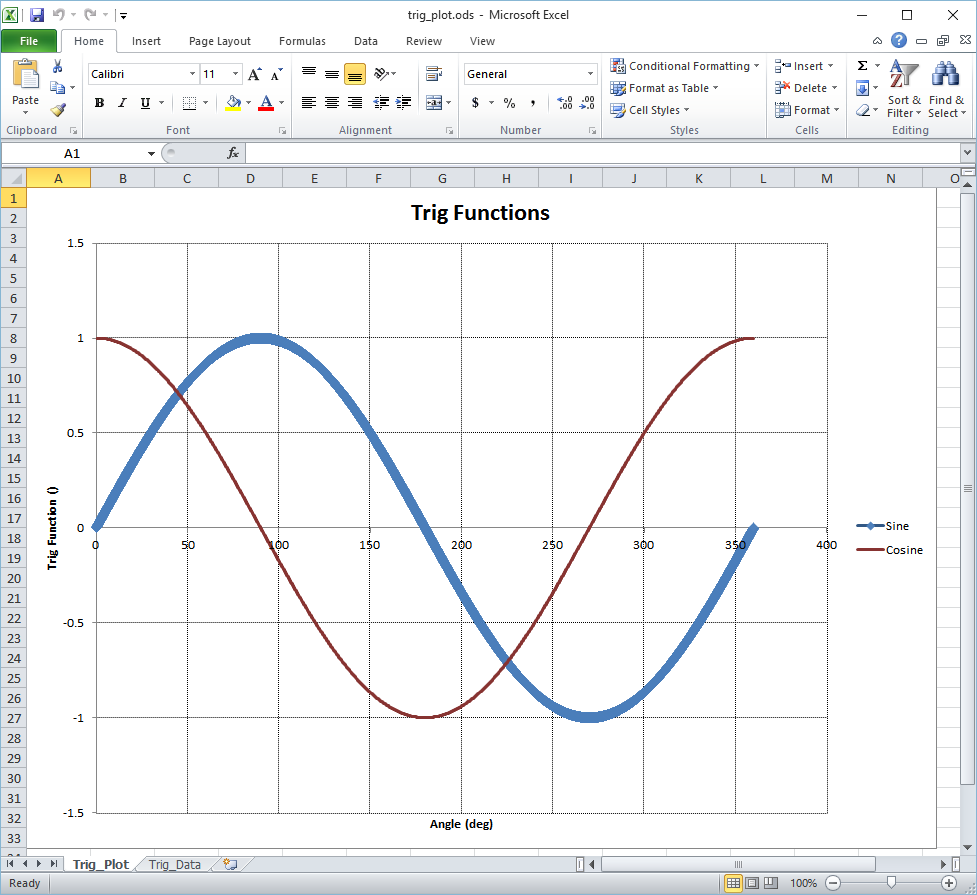
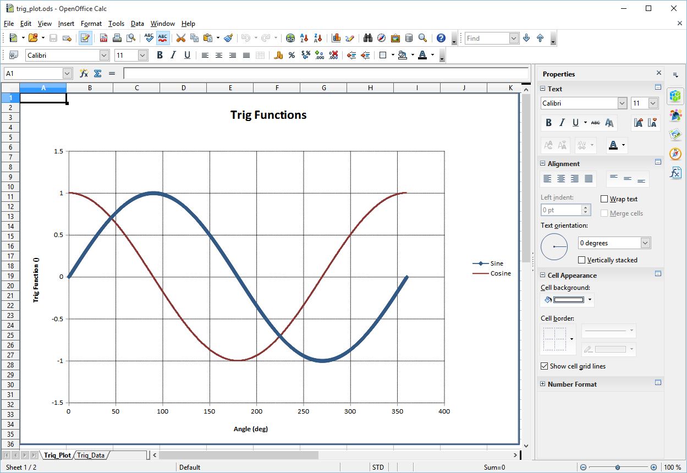

.. quickstart

QuickStart
==========

Install ODSCharts
-----------------

The easiest way to install ODSCharts is::

    pip install odscharts
    
        OR on Linux
    sudo pip install odscharts
        OR perhaps
    pip install --user odscharts

In case of error, see :ref:`internal_pip_error`

.. _internal_source_install:

Installation From Source
------------------------

Much less common, but if installing from source, then
the best way to install odscharts is still ``pip``.

After navigating to the directory holding ODSCharts source code, do the following::

    cd full/path/to/odscharts
    pip install -e .
    
        OR on Linux
    sudo pip install -e .
        OR perhaps
    pip install --user -e .
    
This will execute the local ``setup.py`` file and insure that the pip-specific commands in ``setup.py`` are run.

Running ODSCharts
-----------------

ODSCharts is normally run from a python script. For example, the script below plots sine and cosine vs angle.

The ``list_of_rows`` input variable holds the various curve labels, units and data.

    * Row 1 holds all of the labels of each column
    * Row 2 holds the units for each column (use '' for no units)
    * Rows 3 through N hold data values.

A data sheet named "Trig_Data" is created by the ``add_sheet`` command.

A scatter plot named "Trig_Plot" is created by the ``add_scatter`` command. Note that it identifies "Trig_Data" as the source of the data for the plot.

The columns are identified with a one-based index such that the first column is column number 1. Note that the input ``xcol=1`` idenifies column 1 as the ``X Axis``. The curves are identified as columns 2 and 3 by the input ``ycolL=[2,3]``.

The output ods file is saved as ``trig_plot.ods`` (Note the ``.ods`` is added automatically).

When saving, the flag ``launch=True`` will cause either Excel or Open Office to launch with the named ods file, depending on which application is linked to ``*.ods`` files. Screen shots of both Excel and OpenOffice are shown below the code.

.. code:: python

    from math import *
    from odscharts.spreadsheet import SpreadSheet

    mySprSht = SpreadSheet()

    list_of_rows = [['Angle','Sine','Cosine'], ['deg','','']]
    for iang in range( 3601 ):
        ang_deg = float(iang) / 10.0
        ang = radians(ang_deg)
        
        list_of_rows.append( [ang_deg, sin(ang), cos(ang)] )

    mySprSht.add_sheet('Trig_Data', list_of_rows)

    mySprSht.add_scatter( 'Trig_Plot', 'Trig_Data',
                              title='Trig Functions', 
                              xlabel='Angle', 
                              ylabel='Trig Function', 
                              xcol=1,
                              ycolL=[2,3], showMarkerL=[1,0])
                              
    mySprSht.save( filename='trig_plot', launch=True)

.. _internal_pip_error:

pip Error Messages
------------------

If you get an error message that ``pip`` is not found, see `<https://pip.pypa.io/en/latest/installing.html>`_ for full description of ``pip`` installation.

There might be issues with ``pip`` failing on Linux with a message like::

    InsecurePlatformWarning
            or    
    Cannot fetch index base URL https://pypi.python.org/simple/

Certain Python platforms (specifically, versions of Python earlier than 2.7.9) have the InsecurePlatformWarning. If you encounter this warning, it is strongly recommended you upgrade to a newer Python version, or that you use pyOpenSSL.    

Also ``pip`` may be mis-configured and point to the wrong PyPI repository.
You need to fix this global problem with ``pip`` just to make python usable on your system.

If you give up on upgrading python or fixing ``pip``, 
you might also try downloading the odscharts source package 
(and all dependency source packages)
from PyPI and installing from source as shown above at :ref:`internal_source_install`

